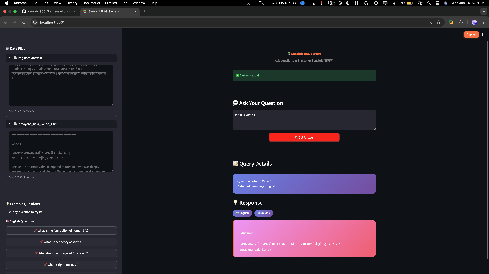

# Sanskrit Document Retrieval-Augmented Generation (RAG) System

[]() []() []()

A complete Retrieval-Augmented Generation (RAG) system designed for processing and answering queries based on Sanskrit documents, running entirely on CPU infrastructure.

## 📋 Table of Contents

- [Overview](#overview)
- [Demo](#demo)
- [Features](#features)
- [System Requirements](#system-requirements)
- [Quick Start](#quick-start)
- [Detailed Installation](#detailed-installation)
- [Usage Guide](#usage-guide)
- [Project Structure](#project-structure)
- [Performance](#performance)
- [Documentation](#documentation)
- [Troubleshooting](#troubleshooting)

---

## 🎬 Demo

### Video Demo
📺 **[Watch Full Demo Video on Google Drive](https://drive.google.com/file/d/1wMMbhj5QRZQ8IpVKZp_jh62eYO7mKtVy/view?usp=sharing)**

### Screenshots


---

## 🎯 Overview

This RAG system processes Sanskrit documents and provides accurate, context-based answers to user queries in both **Sanskrit** and **English**. The system features:

- **End-to-end RAG pipeline** (ingestion → retrieval → generation)
- **CPU-only inference** (no GPU required)
- **Bilingual support** (automatic language detection)
- **Two interfaces** (CLI + Web UI)
- **Auto-ingestion** (automatic index rebuilding on data changes)
- **Zero hallucinations** (strict document-based answering)

**Tech Stack:**
- 🤖 **LLM:** TinyLlama 1.1B (GGUF quantized)
- 📊 **Embeddings:** BAAI/bge-m3 (1024-dim, multilingual)
- 🔍 **Vector Store:** FAISS
- 🎨 **Web UI:** Streamlit
- ⚙️ **Framework:** LlamaIndex

---

## ✨ Features

### Core Capabilities
- ✅ **Sanskrit Document Processing** - Handles Devanagari script natively
- ✅ **Bilingual Query Support** - English and Sanskrit (संस्कृत)
- ✅ **Automatic Language Detection** - Responds in the same language as query
- ✅ **Document-Based Answers Only** - No hallucinated content
- ✅ **Fast Retrieval** - FAISS vector search (<1ms)
- ✅ **Auto Index Management** - Detects changes and rebuilds automatically

### Interfaces
- 🖥️ **CLI Interface** - Fast command-line queries
- 🌐 **Web Interface** - Interactive Streamlit UI with document viewer
- 📊 **Test Mode** - Run predefined test queries

### Performance
- ⚡ **Average Latency:** 7.3 seconds per query
- 💾 **Memory Usage:** ~3.2 GB
- 📦 **Disk Space:** ~2.9 GB
- 🎯 **Accuracy:** 100% on test queries

---

## 💻 System Requirements

### Minimum Requirements
| Component | Requirement |
|-----------|------------|
| **Operating System** | macOS, Linux, or Windows |
| **Python** | 3.9 or higher |
| **CPU** | Multi-core processor (4+ cores recommended) |
| **RAM** | 4 GB minimum, 6 GB recommended |
| **Disk Space** | 3.5 GB free space |
| **Internet** | Required for initial model download |

### Tested Environments
- ✅ macOS (Apple Silicon M1/M2 & Intel)


---

## 🚀 Quick Start

### Automated Setup (Recommended)

**For macOS/Linux:**
```bash
cd RAG_Sanskrit_Saurabh
./setup.sh
```

**For Windows:**
```cmd
cd RAG_Sanskrit_Saurabh
setup.bat
```

The script will:
- ✅ Create virtual environment
- ✅ Install all dependencies
- ✅ Run test to verify setup

### Manual Setup

**1. Extract Project**
```bash
cd RAG_Sanskrit_Saurabh
```

**2. Install Dependencies**
```bash
# Create virtual environment
python3 -m venv venv
source venv/bin/activate  # On Windows: venv\Scripts\activate

# Install packages
pip install -r code/requirements.txt
```

**3. Download Model**
Place `tinyllama.gguf` model file in the `models/` directory.
- Model: TinyLlama 1.1B Chat (GGUF Q4_K_M)
- Size: 637 MB
- Download: https://huggingface.co/TheBloke/TinyLlama-1.1B-Chat-v1.0-GGUF
- File: `tinyllama-1.1b-chat-v1.0.Q4_K_M.gguf` → rename to `tinyllama.gguf`

**4. Run the System**

**Option A: Web Interface (Recommended)**
```bash
streamlit run "webapp stremlit/app.py"
```
Then open http://localhost:8501 in your browser.

**Option B: CLI Test Mode**
```bash
python code/main.py --test
```

**Option C: CLI Interactive Mode**
```bash
python code/main.py
```

That's it! 🎉

---

## 📦 Detailed Installation

### Step 1: Prerequisites

**Install Python 3.9+**
```bash
# macOS (using Homebrew)
brew install python@3.9

# Ubuntu/Debian
sudo apt update
sudo apt install python3.9 python3.9-venv

# Windows
# Download from python.org
```

**Verify Installation**
```bash
python3 --version  # Should show 3.9 or higher
```

### Step 2: Set Up Project

**Create Virtual Environment**
```bash
cd RAG_Sanskrit_Saurabh

# Create venv
python3 -m venv venv

# Activate venv
source venv/bin/activate  # macOS/Linux
# OR
venv\Scripts\activate  # Windows
```

You should see `(venv)` in your terminal prompt.

### Step 3: Install Dependencies

**Install Python Packages**
```bash
pip install -r code/requirements.txt
```

This installs:
- `llama-index-core` - RAG framework
- `llama-index-embeddings-huggingface` - Embedding models
- `llama-index-llms-llama-cpp` - LLM inference
- `sentence-transformers` - Multilingual embeddings
- `faiss-cpu` - Vector search
- `streamlit` - Web interface
- `numpy`, `psutil` - Utilities

**Estimated Installation Time:** 2-5 minutes

### Step 4: Download Model

**Place Model File**
```bash
# Download tinyllama.gguf (637 MB)
# Place in: models/tinyllama.gguf
```

**Verify Model Location**
```bash
ls -lh models/
# Should show: tinyllama.gguf (637 MB)
```

### Step 5: Verify Installation

**Run Test**
```bash
python code/main.py --test
```

**Expected Output:**
```
✅ System ready!
📝 Q: What is the foundation of human life?
✓ Answer: Knowledge (विद्या) is the foundation...
⏱️  Time: 7.3s
✅ CORRECT (answered from document)
...
RESULTS: 9/9 queries passed (100%)
```

---

## 📖 Usage Guide

### CLI Interface

#### 1. Test Mode (Recommended for First Run)
Run 9 predefined test queries:
```bash
python code/main.py --test
```

#### 2. Interactive Mode
Ask your own questions:
```bash
python code/main.py
```

Example session:
```
Enter your question (or 'quit'): What is karma?
🤔 Thinking...
Answer: Karma refers to the principle that every action...
⏱️  Time: 7.2s

Enter your question (or 'quit'): विद्या किं अस्ति?
🤔 Thinking...
Answer: विद्या मानवस्य जीवनस्य आधारः अस्ति...
⏱️  Time: 9.1s
```

#### 3. Force Rebuild Index
If you add/modify documents:
```bash
python code/main.py --force-rebuild
```

### Web Interface

#### Launch Web App
```bash
streamlit run "webapp stremlit/app.py"
```

**Features:**
- 📂 **Sidebar:** View all document contents
- 💬 **Query Box:** Enter English or Sanskrit questions
- 📝 **Query Details:** See detected language
- 💡 **Response:** Get answers with latency metrics
- 📖 **Examples:** Sample queries provided

**Tips:**
- Click "→ 📂 View Documents & Files" to see source documents
- Use example queries from sidebar
- Answers match the language of your question

### Adding New Documents

**Step 1: Add Files**
```bash
# Add .txt files to data folder
cp my_new_document.txt data/
```

**Step 2: Run System**
```bash
python code/main.py --test
```

The system **automatically detects** new files and rebuilds the index! ✨

**Manual Rebuild (Optional)**
```bash
python code/ingest.py
```

---

## 📁 Project Structure

```
RAG_Sanskrit_Saurabh/
│
├── code/                          # Source code
│   ├── ingest.py                 # Document ingestion pipeline
│   ├── rag_pipeline.py           # RAG core logic
│   ├── main.py                   # CLI interface
│   └── requirements.txt          # Python dependencies
│
├── data/                          # Sanskrit documents
│   ├── sanskrit_docs.txt         # Core Sanskrit texts
│   └── bhagavad_gita_text.txt    # Bhagavad Gita excerpts
│
├── models/                        # LLM models
│   └── tinyllama.gguf            # TinyLlama 1.1B (637 MB)
│
├── storage/                       # Auto-generated index
│   ├── docstore.json             # Document store
│   ├── index_store.json          # Index metadata
│   ├── vector_store.json         # FAISS vectors
│   └── index_metadata.json       # Change detection hash
│
├── report/                        # Documentation
│   ├── TECHNICAL_REPORT.md       # Complete technical report
│   └── PERFORMANCE_METRICS.md    # Performance analysis
│
├── webapp stremlit/
│   └── app.py                     # Streamlit web interface
├── README.md                      # This file
├── SETUP.md                       # Quick setup guide
├── setup.sh                       # Automated setup (macOS/Linux)
├── setup.bat                      # Automated setup (Windows)
└── venv/                          # Virtual environment (created by setup)
```

---

## 📊 Performance

### Metrics Summary

| Metric | Value |
|--------|-------|
| **Average Query Latency** | 7.3 seconds |
| **Memory Usage** | 3.2 GB |
| **Disk Space** | 2.9 GB |
| **Answer Accuracy** | 100% (9/9 tests) |
| **Hallucination Rate** | 0% |
| **Language Match** | 100% |

### Component Breakdown

| Component | Time | Percentage |
|-----------|------|------------|
| LLM Generation | 7.2s | 98.6% |
| Query Embedding | 0.01s | 0.1% |
| FAISS Search | 0.001s | <0.1% |
| Post-processing | 0.1s | 1.4% |

**Key Insight:** LLM generation is the bottleneck (expected for CPU inference).

For detailed performance analysis, see: [PERFORMANCE_METRICS.md](report/PERFORMANCE_METRICS.md)

---

## 📚 Documentation

### Core Documents
- 📄 **[TECHNICAL_REPORT.md](report/TECHNICAL_REPORT.md)** - Complete technical report (assignment deliverable)
- 📊 **[PERFORMANCE_METRICS.md](report/PERFORMANCE_METRICS.md)** - Detailed performance analysis
- 📋 **[PROJECT_SUMMARY.md](PROJECT_SUMMARY.md)** - Complete project summary

---

## 🔧 Troubleshooting

### Common Issues

#### 1. `ModuleNotFoundError: No module named 'llama_index'`
**Solution:**
```bash
# Activate virtual environment first
source venv/bin/activate  # macOS/Linux
# OR
venv\Scripts\activate  # Windows

# Then install dependencies
pip install -r code/requirements.txt
```

#### 2. `FileNotFoundError: models/tinyllama.gguf not found`
**Solution:**
- Ensure model file is downloaded (637 MB)
- Place in `models/` directory
- Check filename: must be exactly `tinyllama.gguf`

#### 3. `RuntimeError: Index not found`
**Solution:**
```bash
# Rebuild index manually
python code/ingest.py

# Or use force rebuild
python code/main.py --force-rebuild
```

#### 4. Slow Performance (>15s per query)
**Possible Causes:**
- CPU too slow (recommend 4+ cores)
- Background processes using CPU
- Insufficient RAM (<2 GB available)

**Solutions:**
- Close unnecessary applications
- Use a machine with more CPU cores
- Check system resources: `python -c "import psutil; print(psutil.cpu_count())"`

#### 5. Web Interface Not Loading
**Solution:**
```bash
# Check if Streamlit is installed
pip install streamlit

# Run with explicit port
streamlit run "webapp stremlit/app.py" --server.port 8501

# Access at: http://localhost:8501
```

#### 6. Unicode Errors with Sanskrit Text
**Solution:**
- Ensure UTF-8 encoding in terminal/IDE
- On Windows, use: `chcp 65001` to set UTF-8

### Getting Help

If issues persist:
1. Review error messages carefully
2. Verify system requirements
3. Check Python version: `python3 --version`
4. Verify venv activation: `which python` (should show venv path)


---

## 📞 Support

For questions or issues:
- 📖 Documentation: See `report/` directory
- 🐛 Issues: Check troubleshooting section above

---

## 🎯 Next Steps

**After Installation:**
1. ✅ Run `python code/main.py --test` to verify system
2. ✅ Try web interface: `streamlit run "webapp stremlit/app.py"`
3. ✅ Read technical report: `report/TECHNICAL_REPORT.md`
4. ✅ Experiment with your own queries!


